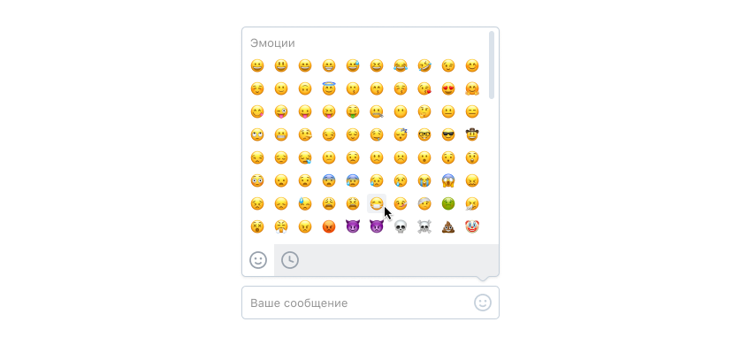

# Тестовое задание в команду Веб-мессенджер в рамках стажировки «ВКонтакте на практике»

Нужно разработать поле ввода с интерфейсом для добавления эмоджи.

- Поле ввода должно изменять размер под введённый текст.
- При нажатии на иконку справа должен открываться выпадающий интерфейс выбора эмоджи.
- В интерфейсе выбора эмоджи внизу есть 2 иконки. Они переключают режим просмотра между всем списком и недавно использованными эмоджи (можно запоминать, например, последние 25 использованных).

## Дополнительное задание

Можно сделать дополнительное задание: находить и подсвечивать в поле ввода меншены, хештеги, ссылки и адреса электронной почты.

## Ресурсы

- [Дизайн в Figma](https://www.figma.com/file/ByVkK6PeZzHobVGHANVwGM/EmojiPicker?node-id=0%3A1)
- [Данные для отображения](https://github.com/Chaptykov/VKFrontendTask/blob/main/sections.json)
